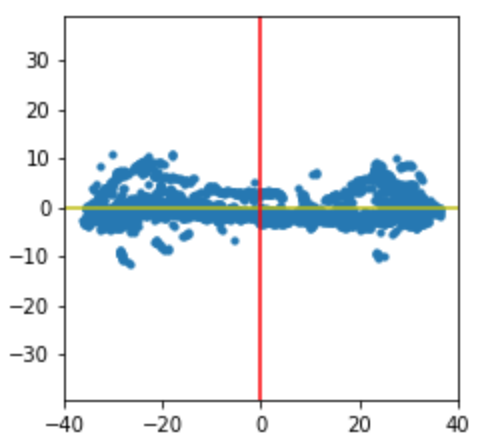

deltascope
===========

This package is designed to quantify biological structures in 3D image data. This do

Features
------

- Compare sets of 3D biological images to identify differences
- Automatically align the structure in the image to correct for variation introduced during mounting and imaging
- Generate descriptive graphs that quantify both the average and variation of the data
- Use machine learning techniques to classify samples and identify regions of statistically significant difference

Installation
------

1. Download deltascope folder from Git.
2. Open terminal for installation
	- Download all the packages mentioned in `requirements.txt` using pip package installer. 
		- For example in order to install `numpy`, use `pip install numpy`.
	- Go to the working directory of your deltascope folder, install a local project in "editable" mode.
		- For example, if you stored your deltascope folder on you desktop, and assume the name of your deltascope name is "deltascope"
		```
		cd desktop
		```
		```
		cd deltascope
		```
		```
		pip install -e .
		```
  - Download [Anaconda](https://www.anaconda.com/what-is-anaconda/) and launch JupyterLab. You should only be required to interface with the `experiments` folder.
  - We work with Jupyter Notebook files within JupyterLab.
  - From the left hand side of the panel, open your deltascope folder from home.
  - In your deltascope folder, open `experiments`.
  - Create a test folder. If you can't create a folder from Jupyter Notebook, work on your local file. 
  - Copy all the files in `template` folder into your own test folder, and rename them by removing "template".

Alignment
------
- Open `alignment.ipyn`

Setting up
------
- In the Parameters section, there are several parameters in `param = {}`: `gthresh`, `scale`, `microns`, `mthresh`, `radius`, `comp_order`, `fit_dim`, `deg`. 
- Adjust `radius` parameter. Adjust radius to 20 for Wild-Type sample and 10 for You-Too sample.
- Edit `expname` to the name of your test folder.
      ``` python
      'expname': 'test folder'
       ```

Setting directories
------
- Reset directory for `gfap` and `at`.
- For windows users, please use backslashes (e.g., `os.path.abspath(.\SampleNum)`).
- For mac users, please use normal slashes (e.g., `os.path.abspath(./SampleNum)`).
- `gfap` corresponds to You-Too data whereas `at` corresponds to Wild-Type data.
- Set root as your cueerent folder
```
root = os.path.abspath('.')
- All output will be saved in a sample output folder with a time stamp
```
Reading in the data
------

- For personal laptops, please try limiting the maximum amount of data being read in under 10 paired samples (so 20 samples in total).
- It will take approximately 30 seconds per sample, and the code prints out how long each iteration takes.
- If the circle on the top right corner of your Jupyter Notebook file is filled, the computer is working to read in the data. It just takes time.

Functions
----------

- k: The dictionary key that identifies this sample. It should be the sample number extracted from the filename.
- df: The dataframe containing datapoints associated with the primary alignment channel, in this case, AT.
- Ldf: A list of additional dataframes corresponding to other channels in the collection. In this template, we are assuming only one additional channel, ZRF.
- ax: The format used to present outputs. In our case there are two rows and three columns, 2x3.

Example Alignment
------

- *Note that all the code should be run in order--because all the objects for different alignments all have the same names, running the code not in the order it's written will mess up the data.*
- Four alignment correction options: dotted line is where we want the commissure to be, and solid line is where the commissure in the actual sample is.


- Use the corresponding functions within each category to correctly align the samples.
- The `ut.make_graph(df1,Ldf1)` functions under category C and D are currently not working.
- In the actual graphs deltascope outputs, the yellow line represents x-axis, red line y-axis and teal line z-axis.
  - First column
    - this is a view in the xy plane: we are viewing the parabolic commissure structure from the front. Therefore, we want the commissure to lie flat on x-axis in the final alignment.
    - The first alignment picture below is how an ideal xy plane view of the commissure should look like: the commissure lies flat on the x-axis. The second alignment picture suggests that there still needs to be some adjustments done: the slightly curved shape formed by the data points suggests that the two tails of the parabolic commissure is probably tilted above the x-axis, so we would want the two tails drop until they align with the x-axis.
    
    


  - Second column
    - this is a view in the xz plane: we are viewing the commisure from above, and we are able to see the very obvious commissure structure.
  - Third column
    - this is a view in the yz plane: we are viewing the parabolic commissure from its side. Since this is a side view of the structure, we would expect it to be lying flat on the teal-colored z-axis, but empirical results have shown that it is the best when the commisure is tilted 50 degrees below the z-axis. Here is an example:
    


Finishing up
-------------

- Click on `File` in the upper left corner of JupyterLab and go down to `Export Notebook As...` and save your output as html. This way the next time you need to check your alignments there is no need to take a long time to read in the data again and run through the entire file.

Support
------

- Complete documentation is available on [Read the Docs](http://deltascope.readthedocs.io/en/latest/).
- Check out the [Frequently Asked Question <faq>]() page.
- Submit an issue describing a problem or question on the project's Github [Issue Tracker](http://github.com/msschwartz21/deltascope/issues).

Contribute
------

- Issue Tracker: https://github.com/msschwartz21/deltascope/issues
- Source Code: https://github.com/msschwartz21/deltascope

License
------

This project is licensed under the GNU General Public License.
